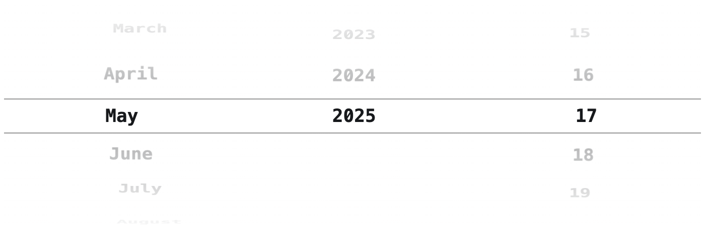
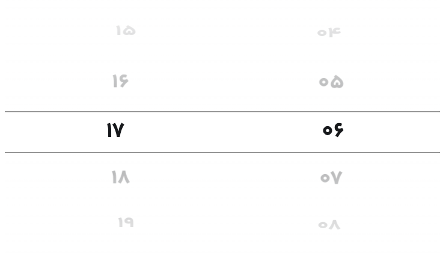
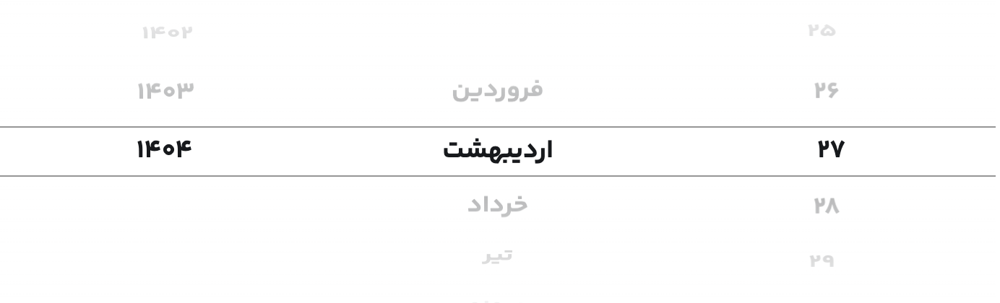

<h1 align="center" id="title">React Time Date Picker</h1>

<p id="description">A React component library providing elegant and intuitive iOS-style pickers for Gregorian dates times and Jalaali (Persian) dates and Hijri dates offering a consistent user experience in your React applications.</p>

[](#)
[](#)
[](#)
[](#)
[](#)

<h2>🧐 Features</h2>

Here're some of the project's best features:

- Time Picker
- Date Picker
- Jalaali Date Picker
- Hijri Date Picker

<h2>🛠️ Installation Steps:</h2>

<p>1. Install</p>

```
npm install @moamfar/react-time-date-picker
```

<p>2. import style.css to your code  </p>

```
import "@moamfar/react-time-date-picker/dist/style.css";
```

<h2>📸 ScreenShots</h2>

<p>Date Picker</p>



<p>Time Picker</p>



<p>Date Picker Jalaali</p>



<p>Date Picker Hijri</p>


<h2>🔴 Props</h2>

<h3>TimePicker Props</h3>

|         Prop         |                     Description                     | Required |                                               Default Value                                                |
| :------------------: | :-------------------------------------------------: | :------: | :--------------------------------------------------------------------------------------------------------: |
|     selectedTime     |            value of returned time object            |   Yes    |                                                 undefined                                                  |
|   setSelectedTime    | function for setting value of returned time object  |   Yes    |                                                 undefined                                                  |
|      is24Hours       |    if the time picker should use 24 hours format    |    No    |                                                   false                                                    |
|      utcOffset       |  Offset of moment utc. It can be string or number.  |    No    |                                                    210                                                     |
|    submitCallback    | function that calls after clicking on submit button |    No    |                                                 undefined                                                  |
|     submitTitle      |               Title of submit button                |    No    |                                                  "Submit"                                                  |
|   buttonClassName    |           Tailwind classNames for button            |    No    |                     "w-full bg-black rounded-md flex items-center justify-center h-10"                     |
| submitTitleClassName |        Tailwind classNames for button title         |    No    |                                                "text-white"                                                |
|  containerClassName  |          Tailwind classNames for container          |    No    | "flex px-[10%] md:px-[25%] flex-row items-center justify-center w-full h-[18rem] overflow-hidden relative" |

<h3>DatePicker Props</h3>

|         Prop         |                     Description                      | Required |                                               Default Value                                                |
| :------------------: | :--------------------------------------------------: | :------: | :--------------------------------------------------------------------------------------------------------: |
|     selectedDate     |            value of returned date object             |   Yes    |                                                 undefined                                                  |
|   setSelectedDate    |  function for setting value of returned date object  |   Yes    |                                                 undefined                                                  |
|       maxYear        |                          -                           |   Yes    |                                                Current year                                                |
|       minYear        |                          -                           |   Yes    |                                               100 Years back                                               |
|       maxDate        |   Maximum acceptable date. using timestamp format    |    No    |                                                 undefined                                                  |
|       minDate        |   Minimum acceptable date. using timestamp format    |    No    |                                                 undefined                                                  |
|     maxDateError     | Error string for when the date is after the maxDate  |    No    |                                                 undefined                                                  |
|     minDateError     | Error string for when the date is before the minDate |    No    |                                                 undefined                                                  |
|    submitCallback    | function that calls after clicking on submit button  |    No    |                                                 undefined                                                  |
|     submitTitle      |                Title of submit button                |    No    |                                                  "Submit"                                                  |
|   buttonClassName    |            Tailwind classNames for button            |    No    |                     "w-full bg-black rounded-md flex items-center justify-center h-10"                     |
| submitTitleClassName |         Tailwind classNames for button title         |    No    |                                                "text-white"                                                |
|  containerClassName  |          Tailwind classNames for container           |    No    | "flex px-[10%] md:px-[25%] flex-row items-center justify-center w-full h-[18rem] overflow-hidden relative" |
|     columnsOrder     |        order of year, month and day columns.         |   Yes    |                                          ["day", "month", "year"]                                          |
|    sonnerOptions     |                          -                           |    No    |                                                 undefined                                                  |

<h2>💻 Built with</h2>

Technologies used in the project:

- TailwindCSS
- Embla
- moment
- moment-jalaali
- moment-hijri
